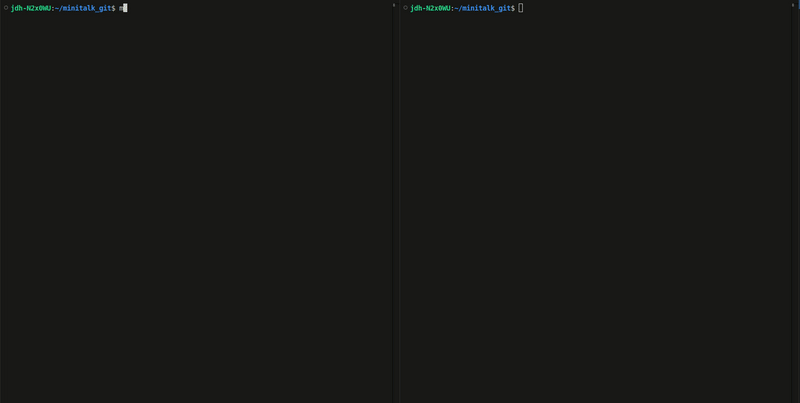

<h1 align="center">Minitalk</h1>



This is a simple communication program that sends messages from a client to a server 1 bit at a time using signals. When the server has recieved the full message it prints it, and sends back a confirmation, and the client prints "Message Successfully Recieved". More than one client can message the server at once. Unicode characters are supported.

## Usage

This project is made to run on **Linux** and has only been tested on Ubuntu.

### Steps to run:

1. **Clone the repository**:
```bash
git clone https://github.com/disinformationalist/minitalk.git minitalk
```

2. **Change to the project directory**:
```bash
cd minitalk
```
3. **Build the executables**:
```bash
make
```
4. **Run the server in one terminal, and the client in another**:
```bash
./server
```
5. **Run a client in a separate terminal, with the pid number of the server(which is printed in the MINITALK sign in green), and the message to send in double or single quotes, and press enter.**
example:

```bash
./client <server pid> "Hello, the waffles are half off today, tell no one"
```